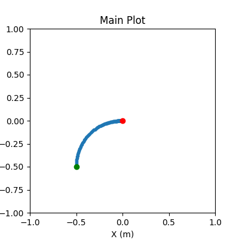
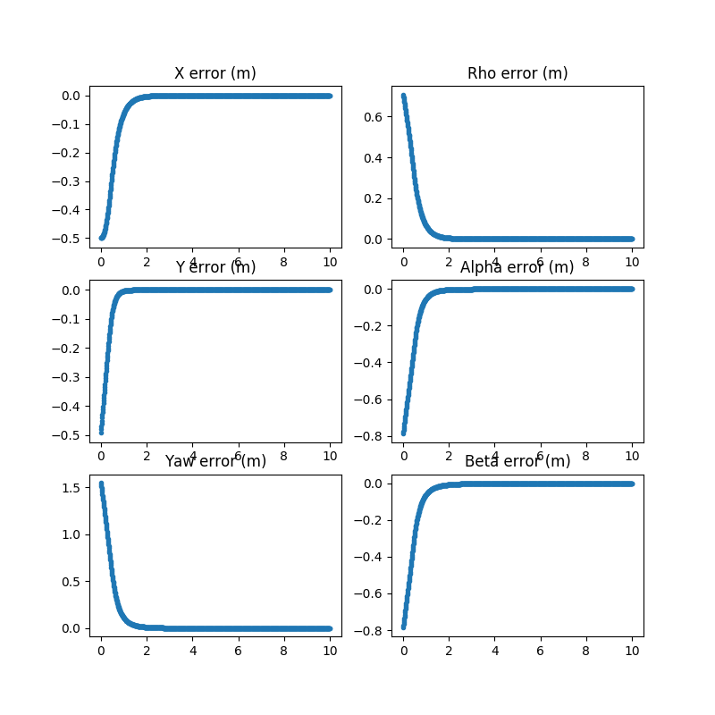

# Car Control
This package contains a collection of nodes that perform local control driving a
differential drive robot to a desired state.


The dd_control_node controller is based on the intuition
from https://cs.gmu.edu/~kosecka/cs485/lec04-control.pdf,
while the power_diagram_node is based on the paper: https://repository.upenn.edu/ese_papers/724/.


## C++ and ROS Usage

The nodes take in the target pose from `~position_cmd` and the current pose/odometry from `~pose`
or `~odom`. And then output the velocity commands to `~commands`.

Example Launching the Controller Nodes:

```xml
<!--Launch a DD Controller Node -->
<group ns="$(arg ns)">
  <node name="dd_control_node" pkg="car_control" type="dd_control_node" output="screen">
        <rosparam file="$(find dd_control)/config/dd_gains.yaml" command="load"/>
        <remap from="~position_cmd" to="<your_target_pose_topic>"/>
        <remap from="~odom" to="<your_odom_topic>"/>
        <remap from="~commands" to="<your_commands_topic>"/>
  </node>
</group>

<!--Launch a Power Diagram Node -->
<group ns="$(arg ns)">
  <node name="power_diagram_node" pkg="car_control" type="power_diagram_node" output="screen">
        <rosparam file="$(find dd_control)/config/power_diagram_gains.yaml" command="load"/>
        <remap from="~position_cmd" to="<your_target_pose_topic>"/>
        <remap from="~odom" to="<your_odom_topic>"/>
        <remap from="~commands" to="<your_commands_topic>"/>
  </node>
</group>
```

## Python Usage

    cd script
    python3 dd_controller.py




